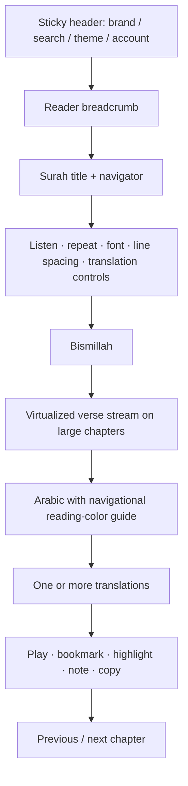
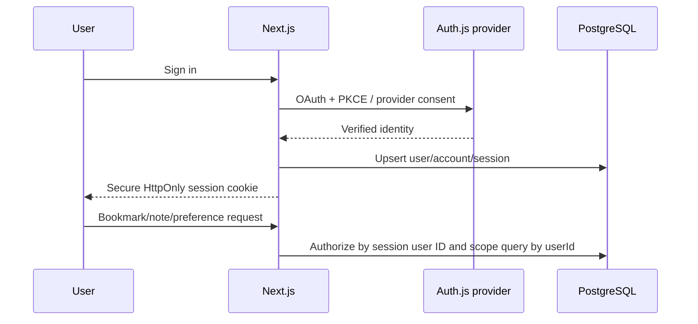

# Platform architecture

## 1. Project structure

```text
src/
  app/                 # App Router pages, metadata, route handlers
  components/          # UI primitives, shell, dashboard, reader engine
  lib/                 # DB, cache, auth guards, content/search adapters
  types/               # Domain contracts shared by client and server
prisma/                # Normalized PostgreSQL schema and seed pipeline
public/                # PWA manifest assets and service worker
docs/                  # Product and operations documentation
```

## 2. Component hierarchy

```text
RootLayout
├── Providers (theme + TanStack Query)
├── PwaRegistration
├── SiteHeader
└── Route content
    ├── HomePage
    │   ├── Continue/Daily/Recently Played cards
    │   ├── Topic shortcuts
    │   └── Goal callout
    ├── SearchPage
    │   └── Search results
    └── ReaderPage
        └── Reader
            ├── Surah navigator
            ├── Reader controls
            ├── Translation comparison
            ├── Verse list
            └── Audio controller
```

## 3. Reader wireframe



## 4. Design system and theme tokens

The interface is intentionally independent of any existing Quran product: quiet paper-like surfaces, near-black ink, a restrained warm accent, large whitespace, and reading-first hierarchy.

| Token | Light | Dark | Purpose |
| --- | --- | --- | --- |
| `canvas` | warm off-white | charcoal | application background |
| `panel` | white | softened charcoal | cards and reader surface |
| `ink` | dark neutral | soft ivory | primary text |
| `muted` | neutral gray | warm gray | supporting copy |
| `line` | pale gray-beige | low-contrast gray | boundaries |
| `sand` | beige | deep brown-gray | selected states |
| `accent` | umber | muted gold | action and orientation |

All interactive controls have visible focus rings, at least 44px touch targets for primary controls, semantic labels, and motion disabled under `prefers-reduced-motion`. The Arabic text carries `lang="ar"` and `dir="rtl"`. The visual word color is an orientation aid, not a tajweed claim; a verified tajweed rules engine should be added before labeling colors as tajweed.

## 5. Database design

`prisma/schema.prisma` contains a normalized model:

- Canonical content: `Surah`, `Ayah`, `Translation`, `AyahTranslation`, `Reciter`, `AudioFile`.
- Auth/account: `User`, `Account`, `Session`, `VerificationToken`, `Profile`.
- Personal study state: `Bookmark`, `Highlight`, `Note`, `Collection`, `CollectionItem`, `UserPreference`, `ReadingHistory`, `ReadingGoal`.
- Search projection: `SearchIndex`, populated by a queue worker and mirrored to Meilisearch.

Important integrity rules: ayahs are unique within a surah, translations are unique per ayah/translation, audio is unique per ayah/reciter, bookmarks are unique per user/ayah, and user-owned records cascade on account deletion.

## 6. Authentication flow



Auth.js owns cookies. Never accept a `userId` from the browser. Production should enable a passwordless email provider as the inclusive default alongside OAuth and configure trusted production hosts only.

## 7. Search architecture

```mermaid
flowchart LR
  I[Content ingest job] --> P[(PostgreSQL canonical content)]
  P --> Q[Outbox/queue]
  Q --> M[(Meilisearch ayah index)]
  U[Search UI] --> A[/api/search]
  A --> M
  A -. provider fallback .-> F[Quran provider search]
  A --> R[(Redis query cache)]
```

Index Arabic normalized text, translation text, surah names, roots, morphology tags, page/juz/hizb, and topic tags. Filterable attributes include language, translation ID, surah, juz, page, and topic. Search responses return canonical verse keys so a result always opens the reader at an exact verse.

## 8. Audio architecture

The reader receives per-ayah audio URLs and controls a single HTML audio element. On `ended`, it advances to the next ayah; repeat-verse is handled without a network roundtrip. The production audio service should issue signed S3/CDN URLs for licensed downloads, store waveform/duration metadata in `AudioFile`, and persist a playback queue (reciter, speed, repeat range, sleep deadline) in local state plus synced preferences.

Background play relies on the browser media session API and a service worker only where the platform permits it; it must never claim universal support. Downloads are an explicit server-authorized job per licensing policy.

## 9. Reading engine and state management

- Server-rendered shell and metadata; reader payloads are cached route-handler responses.
- TanStack Query owns remote content state and stale/cache lifecycle.
- Local component state owns transient reading controls, playback, and selection.
- Authenticated state is written through user-scoped API routes; guest offline bookmarks are local-only and are migrated after sign-in.
- For production, virtualize verses (`@tanstack/react-virtual`) for longer surahs, preserve scroll position by ayah key, and record progress after a debounced reader-visible event.
- Reader coordinates permit navigation by `surahId`, ayah, `juz`, `hizbQuarter`, and page once canonical content is seeded.
